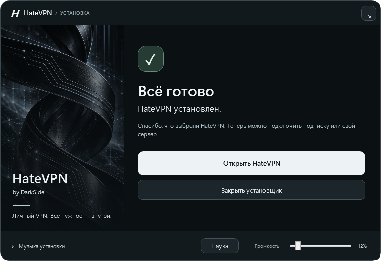

# HateVPN

Личный VPN-клиент для Windows и Android. Подписки, собственный VPS и приглашения для друзей

## Скачать

- [Windows — HateVPN 1.0 Setup](https://github.com/VaelNN/HateVPN/releases/download/v1.0.0/HateVPN-1.0-Setup.exe)
- [Android — HateVPN 1.0.4 APK](https://github.com/VaelNN/HateVPN/releases/download/v1.0.0/HateVPN-Android-1.0.4-arm64.apk)

[Все файлы и описание релиза](https://github.com/VaelNN/HateVPN/releases/tag/v1.0.0).

## Возможности

- Подключение по HTTPS-подписке, группировка серверов и выбор подключения.
- Собственный VPN-сервер: настройка по SSH в Windows и Android прямо в приложении.
- Одноразовые приглашения для друзей и отзыв доступа владельцем VPS.
- Windows: работа в трее, автозапуск, проверка соединения и диагностический отчёт.
- Android: фоновая VPN-служба, управление из уведомления и компактный первый запуск.
- Установщик Windows с выбором папки, ярлыком и деинсталлятором.

| Платформа | Интерфейс | VPN |
| --- | --- | --- |
| Windows 10/11 x64 | C# / .NET 10 / WPF | AmneziaWG, WireGuard, Xray для подписок |
| Android 7+ | Dart / Flutter, Kotlin | sing-box-lx |

Проект используется в небольшом кругу друзей и продолжает развиваться. Настройка Xray на собственном VPS пока скрыта в интерфейсе Windows; подписки по URL поддерживаются.

## Структура

- `app/` - Windows-клиент, служба, установщик и деинсталлятор.
- `android/HateVPN/app/` - Android-клиент и тесты.
- `scripts/` - сборка, настройка VPS и диагностика.
- `installer/` - пакет Windows Installer.
- `tests/` - проверки Windows-компонентов.
- `licenses/` - уведомления и лицензии зависимостей Windows.

## Приглашения

Владелец создаёт приглашение через SSH-доступ к VPS. Получатель вставляет ссылку в HateVPN и получает отдельный VPN-профиль. Пароль SSH другу не передаётся. Для работы приглашений и VPN сервер должен оставаться доступным

Одноразовая активация не защищает от ручного копирования уже полученного VPN-профиля. Отзыв доступа выполняется на сервере. Переустановка с удалением данных требует нового приглашения.

## Установщик

